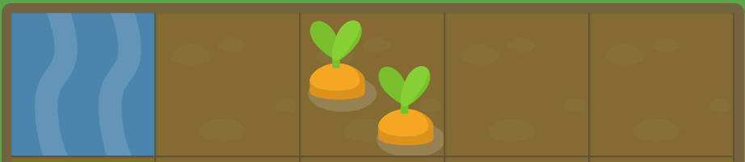

<h1 id="readme-top">MY FLEXBOX FROGGY JOURNEY</h1>
<p class="header">
This GitHub repository documents my Grid Garden adventure—a compilation of grid layout challenges, associated solutions, and a log of my progress as I hone my skills in mastering the principles of grid layouts.</p>

<p align="center">
  <a href="https://github.com/emailjohnthomascaballero">
    
  </a>
</p>

## Table of Contents
<details>
  <summary>VIEW TABLE OF CONTENTS</summary>
  <ol type="I">
    <li><a href="#about">About the Project</a></li>
    <li><a href="#languages">Languages & Tools Used</a></li>
    <li><a href="#usage">Usage</a></li>
  </ol>
</details>

<p align="right">(<a href="#readme-top">back to top</a>)</p>

<h2 id="about">I. About the Journey</h2>
In my journey through Grid Garden, I am committed to deepening my comprehension of grid layout. This compilation acts as a comprehensive exhibition of the code I've developed while progressing through the diverse challenges of Grid Garden. It illuminates my achievements and solutions, showcasing my evolving proficiency in mastering the principles of grid layouts.

<!-- Back to Top -->
<p align="right">(<a href="#readme-top">back to top</a>)</p>

<h2 id="languages">II. Languages and Tools Used</h2>

#### Planning


#### Development


<!-- Back to Top -->
<p align="right">(<a href="#readme-top">back to top</a>)</p>

<h2 id="usage">III. Usage</h2>

_Below is an example of how you can install and setup the application on your device._

1. Clone the repo
   ```sh
   git clone https://github.com/emailjohnthomascaballero/grid-garden.git
   ```
<!-- Back to Top -->
<p align="right">(<a href="#readme-top">back to top</a>)</p>
